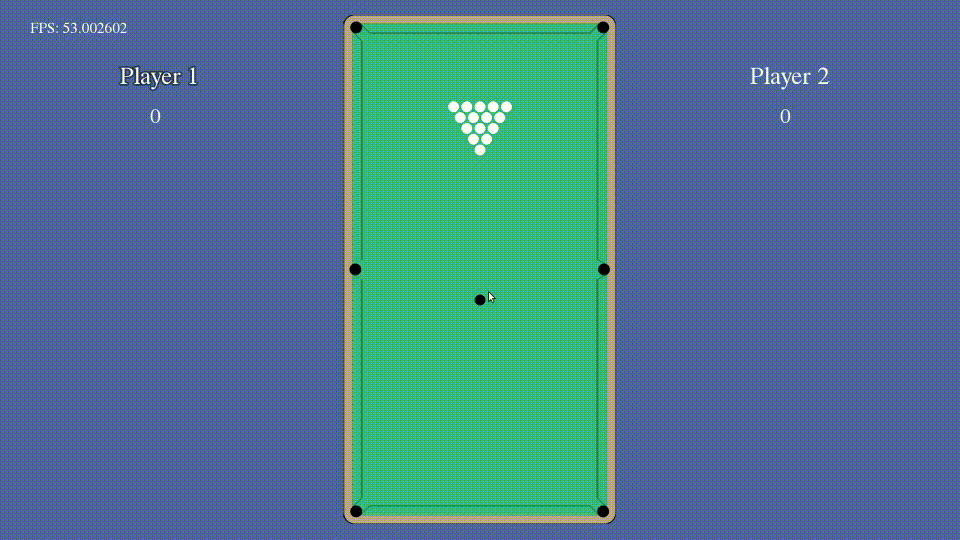

# SFML_billiard

Billiard game based on [SFML_physics](https://github.com/burryfun/SFML_physics)



## Usage

You will need SFML library, that you can install by type in terminal:

```
sudo apt-get install libsfml-dev
```

### Build

```
git clone https://github.com/burryfun/SFML_billiard.git
cd SFML_billiard
make
./main
```


